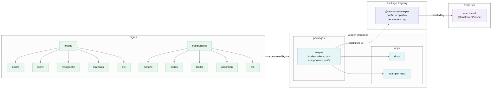

# Vesper

This monorepo houses the project code for Tenstorrent's software design system library, Vesper.

## System Design

High-level, this project flows from Figma -> Vesper Monorepo -> Package Registry -> End User as follows:



### Figma

Figma contains all of the tokens/primitives used to compose the components in the Vesper design system. Tokens are exported as JSON (colors, tracking, leading, spacing, radius) or SVG (icons) to be used as inputs in the tokens package in the monorepo. Tokens and components are consumed by the [**Vesper Monorepo**](#vesper-monorepo).

```
tokens/
  colors/
  icons/
  typography/
  materials/
  etc/
components/
  button/
  inputs/
  tooltip/
  accordion/
  etc/
```

### Vesper Monorepo

The monorepo consumes tokens and component designs from Figma, then assembles them into the vesper package. Vesper bundles tokens, styles, skills, and components into a single package to be published to the [**Package Registry**](#package-registry)

The vesper package get used as input internally for things like the documentation website, and externally by consumer apps to build user interfaces.

```
apps/
  docs/
  example-react/
packages/
  vesper/
```

### Package Registry

The vesper package in the monorepo is what ultimately gets published to the package registry. It contains tokens, styles, agent skills, and components in the design system.

Vesper is set up to publish publicly under the Tenstorrent scope (`publishConfig.access` is `public`), but **it is not published yet** — we do not own the `@tenstorrent` scope on npm. Until that is sorted out, releases stop short of the registry: the release workflow versions the package, opens a "Version Packages" PR, and pushes git tags and GitHub Releases, without publishing anything. See [PUBLISHING.md](./PUBLISHING.md) for how releases work today and what has to change to publish for real. [**End Users**](#end-user) install the vesper package from the registry.

#### Regarding organization-scoped packages

We will need to coordinate with the Tenstorrent org owner to set up an npm account for the Tenstorrent organization so we can publish under the `@tenstorrent` scope.

Because the package publishes with public access, the scope only namespaces it — no npm team membership is needed to install.

### End User

Once vesper is published with public access, installing it requires no npm authentication:

```bash
npm install @tenstorrent/vesper
```

If we ever switch to publishing with restricted access, installs would instead require org membership, and being able to auth into npm using SSO becomes an essential part of installing the package:

1. User gets access to npm org via admin invite to org team
2. User authenticates locally via npm login or auth token in .npmrc (auth tokens can be used in CI environments as well)
3. User installs package

```bash
npm login
npm install @tenstorrent/vesper
```

Once the vesper package has been installed, users can import components and styles freely:

```js
import { Button } from "@tenstorrent/vesper/button";
import { Accordion } from "@tenstorrent/vesper/accordion";
import "@tenstorrent/vesper/styles.css";
```

#### Usage in CI Environments

A public package needs no credentials to install. If we publish with restricted access instead, projects installing the package in CI need an auth token. The token must have read access for installs, and/or publish access for publishing. For example:

```yaml
- run: npm ci
  env:
    NODE_AUTH_TOKEN: ${{ secrets.NPM_TOKEN }}
```

or

```
//registry.npmjs.org/:_authToken=${NPM_TOKEN}
```

## Formatting

We use [`prettier`](.prettierrc.ts) for formatting.

Please ensure that automatic formatting on save is configured in your editor.

To run formatting manually you can run the following command to format all files in the repository:

```sh
yarn format
```

You can also format specific files by passing them as arguments:

```sh
yarn format path/to/file.ts path/to/other-file.tsx
```

The same arguments work with `yarn format:check`, which checks formatting without writing any changes.

### Automatic Formatting Check

We use a git pre-commit hook to check that staged files have been formatted with [our formatting rules](.prettierrc.ts).

If you forgot to format some files in your changes, the hook will block your commit and offer to help you fix them.

### Installation

To install the hook, run the following command:

```sh
git config core.hooksPath .hooks
```

Alternatively, you can copy the hook to `.git/hooks` directly:

```sh
# Copy the hook to .git/hooks
cp .hooks/pre-commit .git/hooks/pre-commit

# Make the hook executable
chmod +x .git/hooks/pre-commit
```

<details>
<summary><h5>Bypass</h5></summary>

To bypass the hook for a single commit, add `--no-verify` to the end of your commit command

```sh
git commit --no-verify
```

</details>
