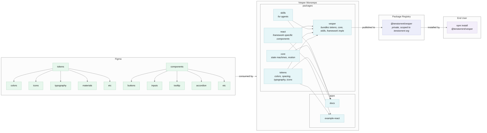

# Vesper

This monorepo houses the project code for Tenstorrent's software design system library, Vesper.

## System Design

High-level, this project flows from Figma -> Vesper Monorepo -> Package Registry -> End User as follows:



### Figma

Figma contains all of the tokens/primitives used to compose the components in the Vesper design system. Tokens are exported as JSON (colors) or SVG (icons) to be used as inputs in the tokens package in the monorepo. Tokens and components are consumed by the [__Vesper Monorepo__](#vesper-monorepo).

```
tokens/
  colors/
  icons/
  typography/
  materials/
  etc/
components/
  button/
  inputs/
  tooltip/
  accordion/
  etc/
```

### Vesper Monorepo

The monorepo consumes tokens and component designs from Figma, then assembles them into separate packages. Packages are as follows:

- __tokens__ contains outputs from Figma (colors, icons, typography, etc)
- __core__ contains state machines to be reused across different framework implementations, motion configs, etc.
- __skills__ contains agent skills which describe how to effectively use the design system to build interfaces
- __react/vue/vanilla/etc__ contain separate component implementations per-framework
- __vesper__ bundles tokens, core, skills, and framework-specific implementations into a single package to be published to the [__Package Registry__](#package-registry)

These packages get used as inputs internally for things like the documentation website, and example apps specific to different frameworks, and externally by consumer apps to build user interfaces.

```
apps/
  docs/
  example-react/
  example-vue/
  example-web-components/
packages/
  tokens/
  core/
  skills/
  react/
  vesper/
```

### Package Registry
The vesper package in the monorepo is what ultimately gets published to the package registry. It contains tokens, core logic, agent skills, as well as individual framework implementations for each component in the design system.

Initially vesper will start as a private package which will be scoped to the tenstorrent GitHub organization. Once the package has stabilized and we have established a practise for authoring changelogs and publishing tags/releases then there is potential to release vesper publicly. [__End Users__](#end-user) install the vesper package from the registry.

#### Regarding organization-scoped packages

We will need to coordinate with the Tenstorrent org owner to set up an npm account for the Tenstorrent organization so we can publish to npm with access restricted to the Tenstorrent org.

Once the package is published privately under the tenstorrent scope, we will also need to manage team access in npm for that org so developers in those teams can install the package.

[npm documentation reference](https://docs.npmjs.com/managing-team-access-to-organization-packages)

### End User

Developers being able to auth into npm using SSO is an essential part of installing an organization-scoped npm package.

1. User gets access to npm org via admin invite to org team
2. User authenticates locally via npm login or auth token in .npmrc (auth tokens can be used in CI environments as well)
3. User installs package

```bash
npm login
npm install @tenstorrent/vesper
```

Once the vesper package has been installed, users can import skills, tokens, core functionality, and framework-specific components freely:

```js
import { TextInput, Accordion } from '@tenstorrent/vesper/react'
import { COLORS } from '@tenstorrent/vesper/tokens'
```

#### Usage in CI Environments

For projects that require installing the package in CI environments, an auth token can be used. The token must have read access for installs, and/or publish access for publishing. For example:

```yaml
- run: npm ci
  env:
    NODE_AUTH_TOKEN: ${{ secrets.NPM_TOKEN }}
```
or

```
//registry.npmjs.org/:_authToken=${NPM_TOKEN}
```
